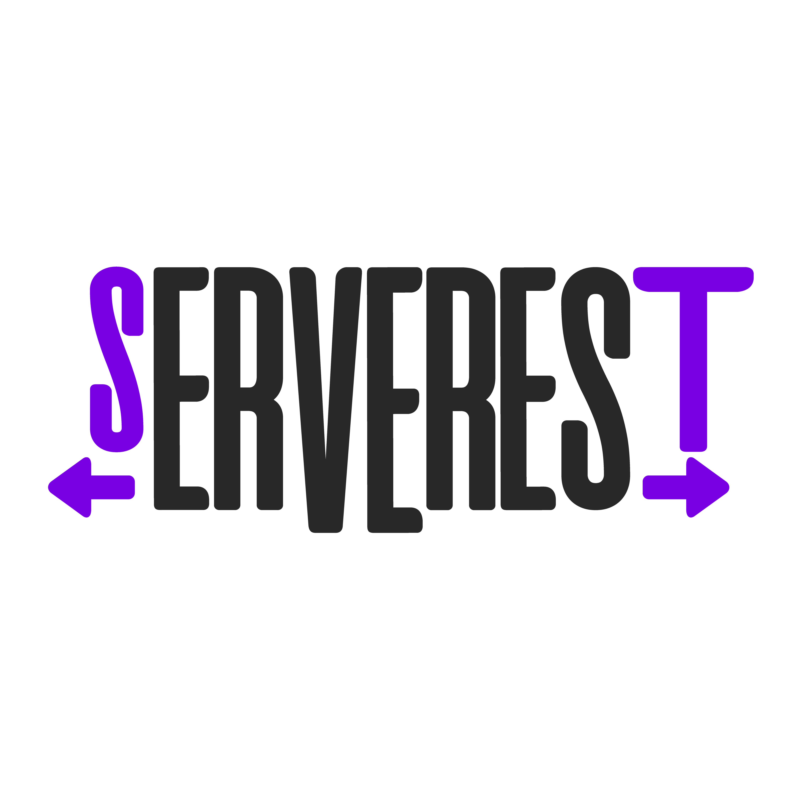

<!--
Hey, thanks for using the awesome-readme-template template.  
If you have any enhancements, then fork this project and create a pull request 
or just open an issue with the label "enhancement".

Don't forget to give this project a star for additional support ;)
Maybe you can mention me or this repo in the acknowledgements too
-->
<div align="center">

  
  <h1>Serverest - Cypress Automation [azeez] :rocket:</h1>

  <p>
    Bem-vindo ao projeto Serverest - Cypress Automation! Este projeto é uma estrutura já montada para automação de testes com Cypress no site Serverest. :tada:
  </p>
  
  
<!-- Badges -->


</div>

<br />

<!-- About the Project -->
## :star2: Sobre o projeto


<!-- Screenshots -->
### :camera: Time-lapse
 

<div align="center"> 
  
</div>


<!-- TechStack -->
### :space_invader: Tech Stack
> 

<!-- Dev Dependencies -->
### 🛠️ Dev Dependencies
> 

<!-- Roadmap -->
## 📄 Páginas testadas

* [x] Cart  |  -> Testes limitados devido ao desenvolvimento da funcionalidade estar em andamento
* [x] Home
* [x] Wishlist
* [x] Access
  * [ ] Signup
  * [ ] Login 

<!-- Getting Started -->
## 	:toolbox: Getting Started

<!-- Prerequisites -->
### :bangbang: Pré-requisitos

Esse projeto utiliza NPM como Package Manager
> 

> 

<!-- Installation -->
### :gear: Instalação

Clone o repositório para sua máquina
```bash
  git clone https://github.com/eiazeez/serverest-cypress-automation.git
```

Vá para a pasta do repositório

```bash
  cd my-project
```

Instale as depedências do projeto utilizando npm
```bash
  npm install
```
---
<!-- Running Tests -->
### :test_tube: Rodando os testes

Para rodar os testes com a interface gráfica do Cypress, utilize o comando abaixo
```bash
  npx cypress open
```

<!-- Run headless -->
### :running: Rodando em headless

Para rodar em headless, pode utilizar o comando abaixo

```bash
  npx cypress run --browser chrome
```


<!-- Usage -->
## :eyes: Padronização de código

Este projeto trabalha com PageObjects + Cypress Custom Commands


```javascript
import SignupPage from "../support/pages/signup"

it('Então deve ser possível se cadastrar com sucesso', function(){

  const data = this.data.registerUser

  cy.apiDelete(data)

  cy.visit('/login')

  SignupPage.fillSignupForm(data)
  SignupPage.submitSignupForm()

})
```

<!-- Contact -->
## :handshake: Contato
O Serverest - Cypress Automation [azeez] é um projeto de automação criado por:

👨‍🏫 - Isaac Douglas
> 🌐 Seu Linkedin é [linkedin.com/in/isaacdouglas](https://www.linkedin.com/in/isaacdouglas/)

> 💻 Seu github é [github.com/eiazeez](https://github.com/eiazeez)